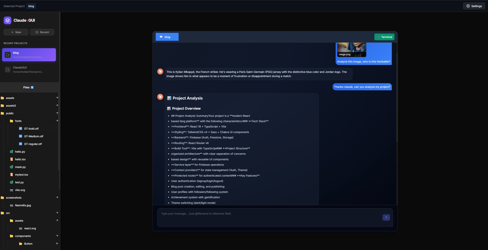

# ClaudxGUI 🚀

**A secure, developer-focused GUI for Claude AI with advanced project management and integrated development tools.**

Welcome to ClaudxGUI - the most comprehensive graphical interface for working with Claude AI on software projects. Built specifically for developers who need more than just a simple chat interface, ClaudxGUI combines the power of Claude AI with professional development tools, security controls, and project-based workflows.



## ✨ Features

### 🔒 **Advanced Security & Permission System**
- **Granular permission control** - Toggle Write, Edit, Delete, and Bash operations independently
- **Real-time filesystem monitoring** - Prevent unauthorized file modifications
- **Security wrapper** - Automatically terminates processes that violate permission settings
- **Settings-based tool filtering** - Fine-tune which Claude tools are available

### 💬 **Intelligent Chat Interface**
- **Project-based conversations** - Persistent chat history for each project
- **Smart message formatting** - Syntax highlighting and structured responses
- **File mentions** - Reference files using `@filename` with autocomplete
- **Image support** - Upload and analyze images with automatic thumbnails
- **Real-time typing animations** - Visual feedback for Claude responses

### 🗂️ **Advanced Project Management**
- **Project-based organization** - Each project maintains its own context and history
- **File tree browser** - Real-time file system updates and change detection
- **Built-in file editor** - Syntax highlighting with CodeMirror integration
- **Path resolution** - Support for both absolute and relative project paths

### ⚡ **Integrated Development Environment**
- **Multi-shell terminal** - WSL, PowerShell, CMD, Bash, Zsh, Fish support
- **Tabbed interface** - Switch between chat and multiple terminal sessions
- **Diff visualization** - See file changes with syntax-highlighted diffs
- **Operation tracking** - Real-time display of Claude's tool usage

### 🛠️ **Developer Tools**
- **File change monitoring** - Automatic detection of new/modified files
- **Tool notifications** - Visual feedback for all Claude operations
- **Context menus** - Right-click actions for files and folders
- **Keyboard shortcuts** - Efficient navigation and controls

## 📋 Prerequisites

Before installing ClaudxGUI, ensure you have the following installed:

- **Node.js** (v18 or higher) - [Download here](https://nodejs.org/)
- **npm** or **yarn** package manager
- **Claude CLI** - [Installation guide](https://docs.anthropic.com/en/docs/claude-code)
- **Git** (for cloning the repository)

### System Requirements
- **Operating System**: Windows 10/11, macOS 10.15+, or Linux
- **RAM**: 4GB minimum, 8GB recommended
- **Storage**: 500MB for installation
- **Terminal**: Access to a command-line interface

## 🚀 Installation

### 1. Clone the Repository
```bash
git clone https://github.com/yourusername/ClaudxGUI.git
cd ClaudxGUI
```

### 2. Install Dependencies
```bash
# Install frontend dependencies
npm install

# Install additional development dependencies
npm install -g tsx typescript
```

### 3. Configure Claude CLI
Ensure Claude CLI is properly configured with your API key:
```bash
claude auth login
```

### 4. Set Up Environment (Optional)
Create a `.env` file in the root directory for custom configurations:
```env
PORT=3001
HOST=localhost
NODE_ENV=development
```

### 5. Build the Application
```bash
# Build the frontend
npm run build
```

## 🎯 Usage

### Starting ClaudxGUI

1. **Start the Backend Server**
   ```bash
   npm run dev:server
   ```

2. **Start the Frontend (in a new terminal)**
   ```bash
   npm run dev
   ```

3. **Access the Application**
   Open your browser and navigate to `http://localhost:5173`

### Quick Start Guide

1. **Create or Select a Project**
   - Click "Select Project" or use the project picker
   - Navigate to your project directory
   - ClaudxGUI will remember your project for future sessions

2. **Configure Permissions**
   - Click the settings icon to open permission controls
   - Toggle Write, Edit, Delete, and Bash permissions as needed
   - These settings control what Claude can do in your project

3. **Start Chatting**
   - Type your questions or requests in the chat input
   - Use `@filename` to reference specific files in your project
   - Upload images by pasting or using the upload button

4. **Use the File Browser**
   - Browse your project files in the left sidebar
   - Double-click files to view/edit them
   - See real-time updates as Claude modifies files

5. **Access the Terminal**
   - Click the "Terminal" tab to access the integrated terminal
   - The terminal starts in your project directory
   - Use it for running builds, tests, or other commands

### Advanced Features

- **File Mentions**: Type `@` followed by a filename to get autocomplete suggestions
- **Image Analysis**: Paste images directly into the chat for Claude to analyze
- **Diff Viewing**: See exactly what changes Claude made to your files
- **Permission Control**: Adjust security settings without restarting the application
- **Project Switching**: Quickly switch between different projects and their chat histories

## 🛠️ Development

### Project Structure
```
ClaudxGUI/
├── src/                 # Frontend React application
├── server/              # Backend Node.js server
├── public/              # Static assets
├── data/                # SQLite database and uploaded images
├── screenshots/         # Application screenshots
└── package.json         # Dependencies and scripts
```

### Available Scripts
- `npm run dev` - Start development frontend
- `npm run dev:server` - Start development backend
- `npm run build` - Build for production
- `npm run lint` - Run ESLint
- `npm run preview` - Preview production build

## 📝 License

This project is licensed under the MIT License - see the [LICENSE](LICENSE) file for details.

## 🤝 Contributing

Contributions are welcome! Please feel free to submit a Pull Request. For major changes, please open an issue first to discuss what you would like to change.

## ⭐ Support

If you find ClaudxGUI helpful, please consider giving it a star on GitHub! Your support helps make this project better for everyone.

---

**Built with ❤️ for the developer community**
